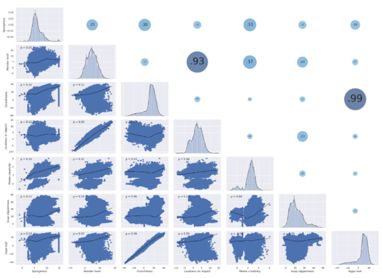

# timeseries-forecasting
Timeseries forecasting using Deep Learning methods.

### Dataset Analysis
We cannot perform any feature engineering on the dataset since we cannot assign any meaning to the data.
However we noticed that certain feature trends look very similar.

After performing a correlation analysis, using a scatter plot, it is evident the correlation between ‘Crunchiness’ and ‘Hype Root’ and between ‘Wonder Level’ and
‘Loudness on Impact’.

We also found no particular trend or seasonality in the dataset, confirmed by the following
analysis: the mean and stddev are constant over time, Augmented Dickey-Fuller test returned
a p-value <= 0.05 for each time series.
So we can conclude their stationarity.

Dataset is not normalised, so we normalised it with Scikit Learn MinMaxScaler, to obtain mean
= 0 and stddev = 1

### Models
We tried the following models:
1. Dense NN
2. Conv1D NN
3. Recurrent NN (both LSTM and GRU)
4. Seq2Seq (LSTM)

Using only Dense layers or Convolutional layers, gave us unsatisfying performances, so we
quickly moved on to test different parameters and models within RNNs.
The most significative hyperparameters we analysed were:

● Window size
● Units per Recurrent Layer
● Number of Layers

We tried using Conv1 layers after the input layer to see if the model could learn local patterns
from the time series (1), but the results weren’t significant: accuracy didn’t improve.
We tried training with Dropout and Recurrent Dropout (2), but the tradeoffs were not worth it,
since it lengthened the training time exponentially and the difference with models without
dropout was minimal or worse in certain cases.
At this point we decided to try oneshot models with an output size of (1200, 7), adjusting
model.py by trimming the predicted array size.
We tried autoregression but it didn’t provide significatively different results.
Regarding the correlation between the two pairs of features, we tried to drop one feature from
each couple, in order to train a model on 5 features, perform a prediction, and then recreate
the two dropped features by duplicating the other feature of the pair on model.py. It provided
acceptable results (6.8 on the submission score). More details are available in the notebook
features-dropped.ipynb.
In order to have a validation of the model as unbiased as possible, we decide to apply
cross-validation, taking precautions since we’re dealing with time series. We used Scikit Learn
TimeSeriesSplit to maintain the temporal dependencies of the time series (see
350x1gru_model.ipynb).

We tried then to apply a Seq2Seq model (see notebook seq2seq.ipynb).
The model was made using LSTM both for the Encoder and the Decoder, a window of 200 and
autoregression.
However the performances obtained were not satisfying (~10 as submission score).

1 F. Chollet, Deep Learning with Python, 2017
2 F. Chollet, Deep Learning with Python, referring to Yarin Gal,
https://mlg.eng.cam.ac.uk/yarin/thesis/thesis.pdf

We noticed that models with smaller windows (< 400) yielded better results in the
submissions, as well as in local testing (i.e. prediction better matching the test shape). We can
hypothesise that bigger windows lead to overfitting.

Overall, our best performing model is surprisingly simple: it consists of just a single GRU layer with a small window and a small
amount of units. In the image on the side the red line represents the predictions of the best model. We can observe it’s much less noisy than the
ones with multiple layers.

